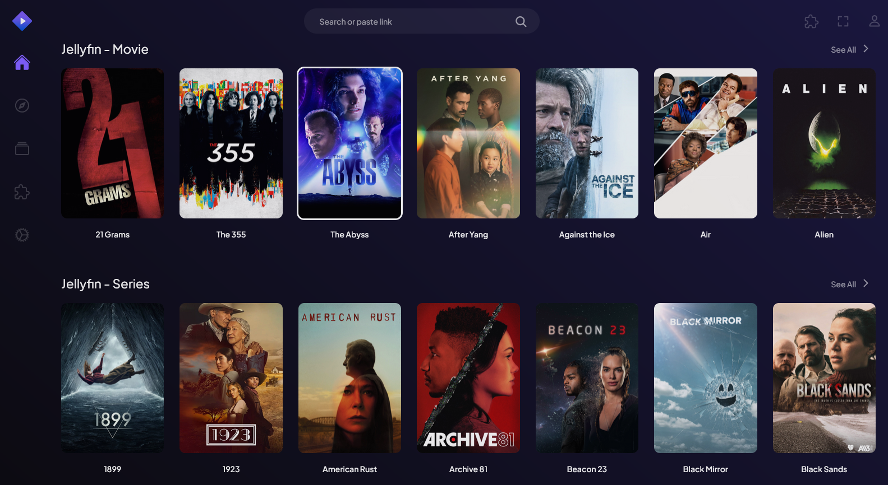
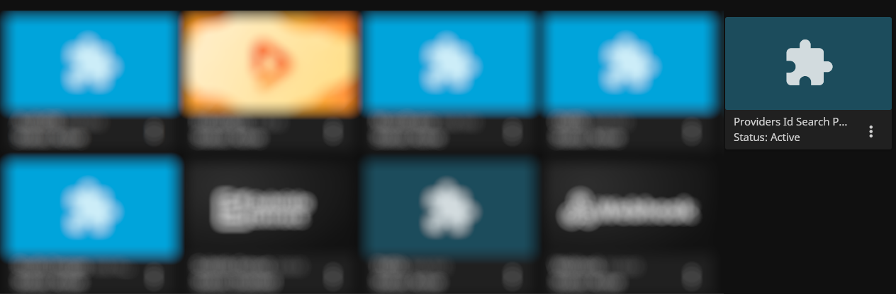

# Stremio Jellyfin Addon

[Stremio](https://www.stremio.com/) addon that enables streaming movies and TV series from your own Jellyfin server. Addon runs entirely locally, ensuring that none of your data is shared outside of your own network. It provides Stremio with a 'library' featuring your Jellyfin movies and TV series collection, allowing you to stream seamlessly both movies and series to your favorite Stremio player.

## Installation

This addon consists of two parts: Stremio Addon and supporting Jellyfin Extension adding Jellyfin search 
capability using IMDB identifiers. Both components are required.

### Jellyfin Stremio Companion Plugin

To install [it](https://github.com/akarazniewicz/jellyfin-providersid-search-plugin), simply add following, new addon repository to Jellyfin (`Jellyfin > Dashboard > Plugins > Repositories`):

https://raw.githubusercontent.com/akarazniewicz/jellyfin-providersid-search-plugin/main/manifest.json

You will have new plugin available in Jellyfin. Just activate 'Providers ID Items Search API' plugin.

### Jellyfin Stremio Addon

Additionally Stremio addon should be installed in your local environment (requires Docker).

To install it:

`docker pull ghcr.io/akarazniewicz/stremio-jellyfin:latest`

and then run it:

`docker run -p 60421:60421 -e JELLYFIN_USER="<your jellyfin username>" -e JELLYFIN_PASSWORD="<your jellyfin user password>" -e JELLYFIN_SERVER="<your jellyfin server address>" ghcr.io/akarazniewicz/stremio-jellyfin"`

where:
* `60421` - is standard port addon is running on (You may remap it in docker)
* `<your jellyfin username>` - Jellyfin username
* `<your jellyfin user password>` - Jellyfin password
* `<your jellyfin server address>` - Jellyfin server address and port (`http://aaa.bbb.ccc.ddd:eee`). Make sure Jellyfin is connectable.

You can run it in Your docker environment (like Rancher or Unraid).

Finally, add the manifest to Stremio to install this addon:

`http://<your docker host>:60421/manifest.json`
